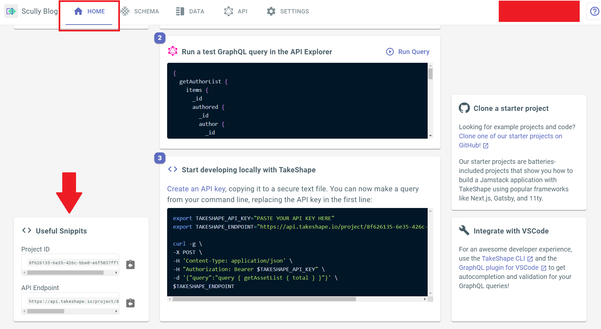

# TakeShape Starter Vue 3

The following is a guide to launching a Vue 3 TakeShape project that injects Ecommerce data into your components.

## Instructions

1. Create a TakeShape project with the pattern in this repo. The button below will deploy the project: 

* 

2. Follow our documentation to [create a read-only API Key](https://app.takeshape.io/docs/api/api-keys).

3. Find your API Endpoint by navigating to your project in the TakeShape web client and clicking on the Home tab. Scroll down, and you'll see your API Endpoint in the `Useful Snippets` section on the bottom right. Refer to the image below:

4. In the terminal on your local machine, clone this repo with `git clone https://github.com/takeshape/takeshape-starter-vue3`

5. Open the project in your favorite IDE or change directories into it with your terminal.

5. Edit `.env.local-example` in the root directory and replace the text that says `YOUR-ENDPOINT-HERE` with your API Endpoint. Replace the text that says `YOUR-API-KEY-HERE` with your API Key. Rename the `.env.local-example` file to `.env`.

6. Run `npm install` and then `npm run serve` in your terminal.

## Learn More

Check out [our docs on this project](https://app.takeshape.io/docs/get-started/client/vue#using-takeshape-with-vue-3) to learn how this example works.
